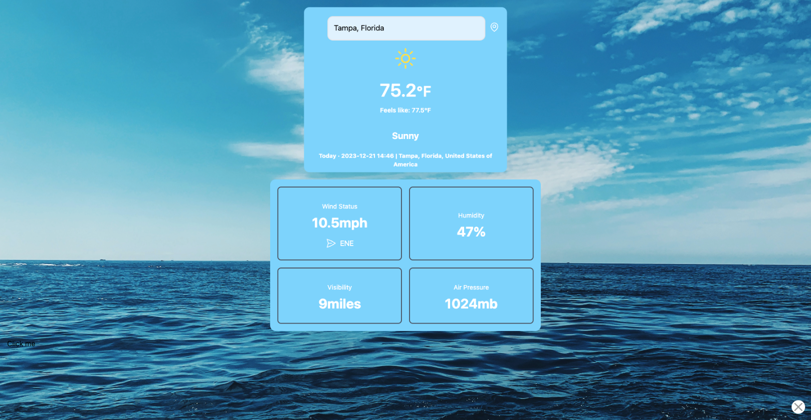
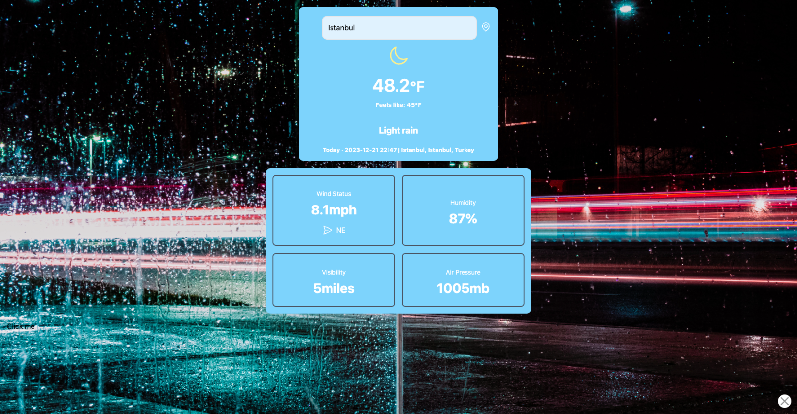
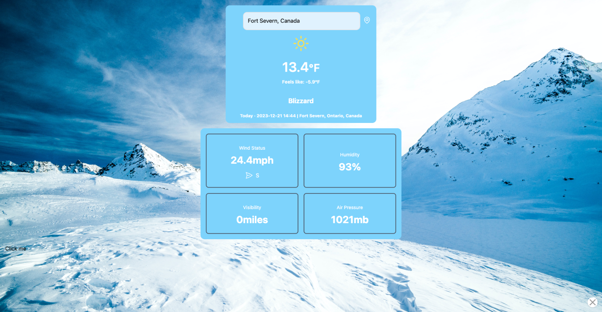
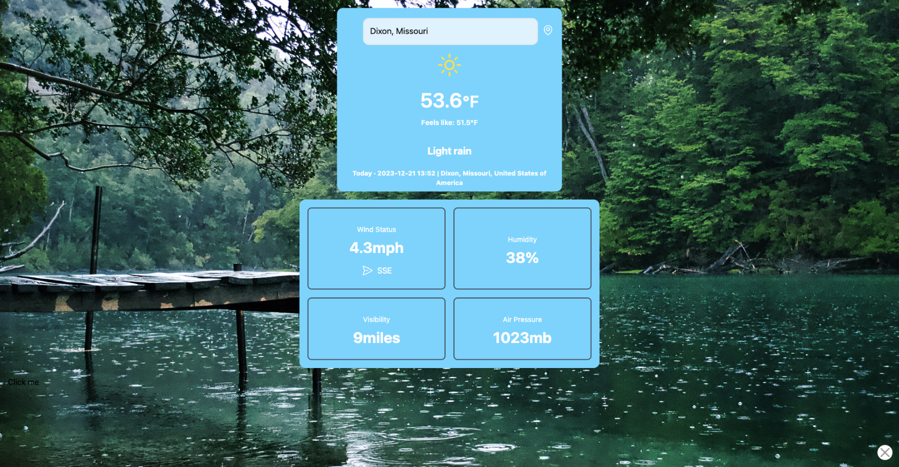
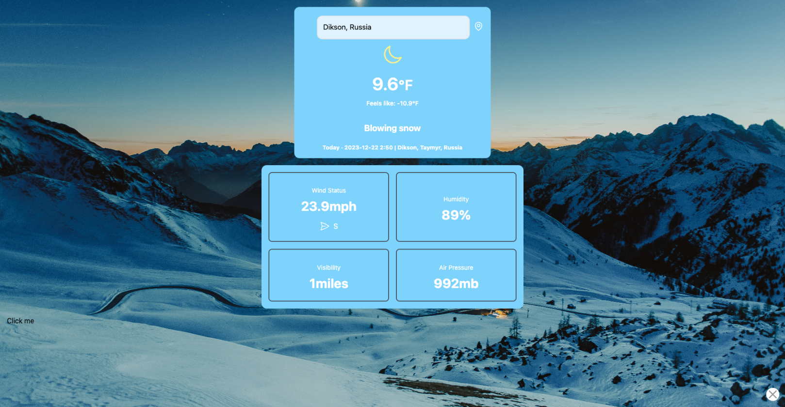

---

<a name="readme-top"></a>

<br />
<div align="center">
<h1><a href="https://resilient-longma-d4ec33.netlify.app/">Weather Watcher</a></h1>
</div>

<!-- TABLE OF CONTENTS -->
<details>
  <summary>Table of Contents</summary>
  <ol>
    <li><a href="#about-the-project">About The Project</a></li>
    <li><a href="#screenshots">Screenshots</a></li>
    <li><a href="#technologies-used">Technologies Used</a></li>
    <li><a href="#getting-started">Getting Started</a></li>
    <li><a href="#key-features">Key Features</a></li>
    <li><a href="#next-steps-and-future-enhancements">Next Steps and Future Enhancements</a></li>
    <li><a href="#contact">Contact</a></li>
  </ol>
</details>

## About The Project

Weather Forecast App is a sleek, user-friendly application designed to provide real-time weather updates and forecasts. It allows users to search for weather data by city, offering a dynamic and engaging experience with background changes reflecting current weather conditions.

## Screenshots






## Technologies Used


## Getting Started

To get a local copy up and running, follow these simple steps:

1. Clone the repository
   ```sh
   git clone https://github.com/drewkybrown/weather-watcher/tree/v2
   ```
2. Install NPM packages
   ```sh
   npm install
   ```
3. Enter your API keys in `.env.local`
   ```
   VITE_WEATHER_API_KEY=your_api_key
   VITE_TOMORROW_API_KEY=your_api_key
   ```
4. Start the server
   ```sh
   npm run dev
   ```

## Key Features

1. Real-time weather updates.
2. Dynamic backgrounds based on weather conditions.
3. Search functionality for finding weather by city.
4. Responsive design for various devices.
5. Detailed weather statistics including temperature, humidity, and more.

## Next Steps and Future Enhancements

- Integration with a mapping API for enhanced location search.
- User preferences for measurement units (Celsius/Fahrenheit).
- Additional weather details like sunrise/sunset times.

## Contact

Drew Brown

[](https://www.linkedin.com/in/brown-k-andrew/)

<p align="right">(<a href="#readme-top">back to top</a>)</p>

---
